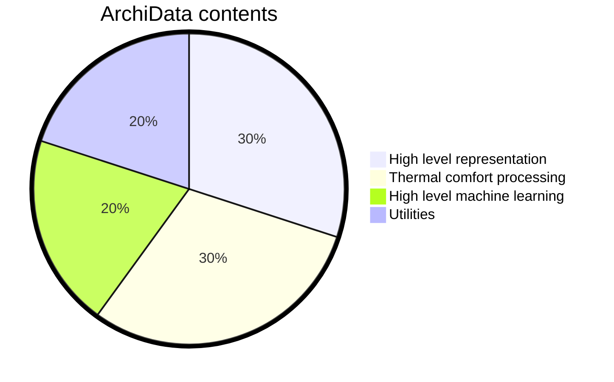
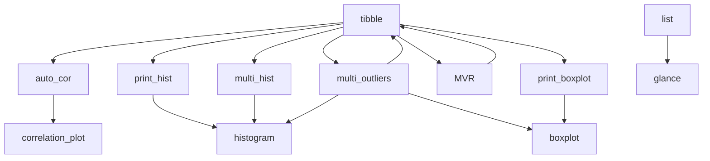
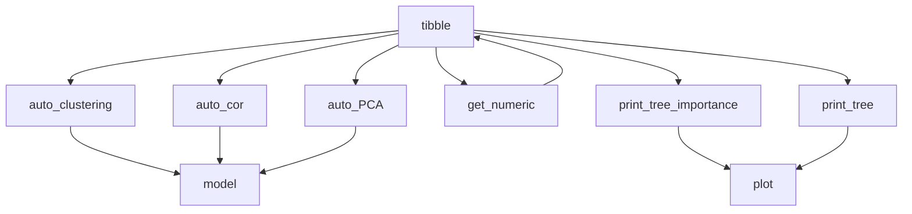
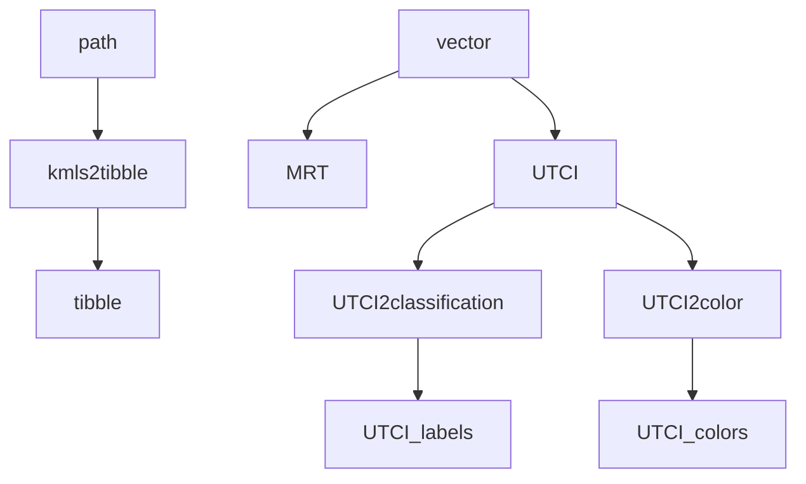

# 🏛️ ArchiData

[](https://github.com/RodGal-2020/ArchiData/actions/workflows/pages/pages-build-deployment)
[](https://github.com/RodGal-2020/ArchiData/actions/workflows/r.yml)
[](https://lifecycle.r-lib.org/articles/stages.html)
[](https://app.codecov.io/gh/RodGal-2020/archiData?branch=main)

`ArchiData` is an R package for the analysis of architectural data. It provides a suite of functions for analyzing and visualizing various aspects of architectural design, such as building dimensions, room layouts, and facade features.

> **Warning**: This is package is under development, and it comes with no warranty of any kind.

## Installation

You can install `ArchiData` from GitHub using the `devtools` package:

```r
devtools::install_github("RodGal-2020/ArchiData")
```

## Usage

To use `ArchiData`, simply load the package and start exploring your architectural data.

```r
library(ArchiData)
help(package="ArchiData")
```

## Status

Here you can see a quick overview of the package, as now it's in a development stage and it's not yet ready for production. The following diagrams show the main functions of the package.



### High level representation



### High level machine learning



### Thermal comfort processing



### Utilities

- `translate`
- `check_path`
- `inspect_environment`
- `package_info`
- `refactor`
- `template`

#### Deprecated

- `setup`
- `three_dots`

## License

See [`LICENSE.md`](LICENSE.md).
